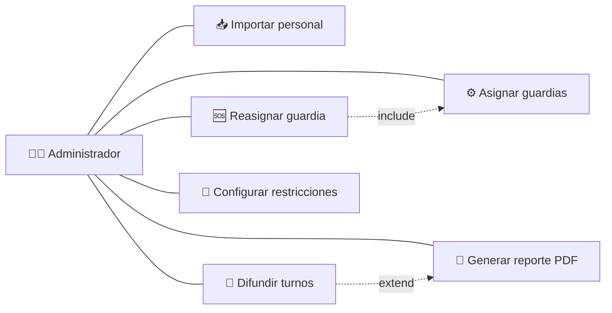
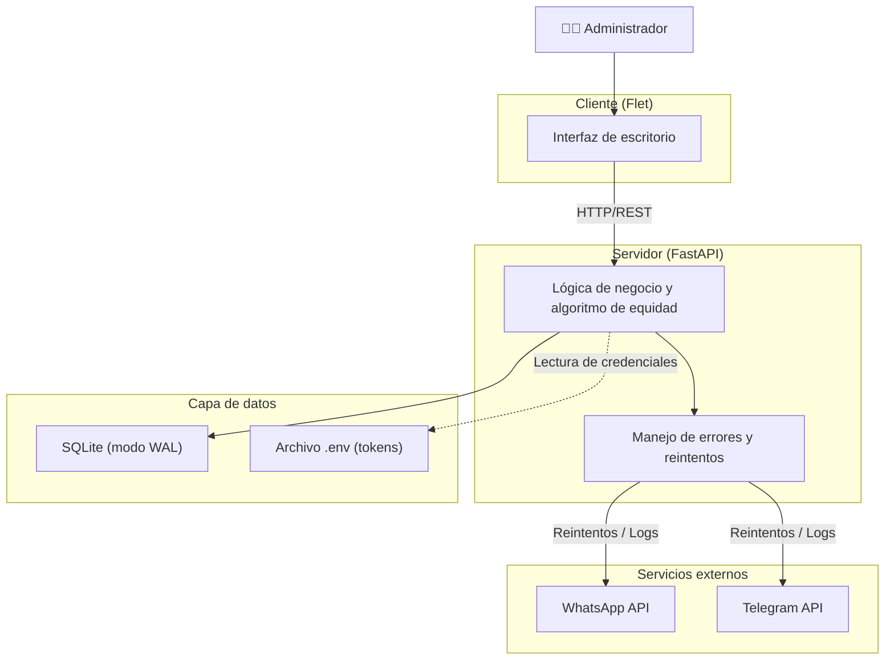
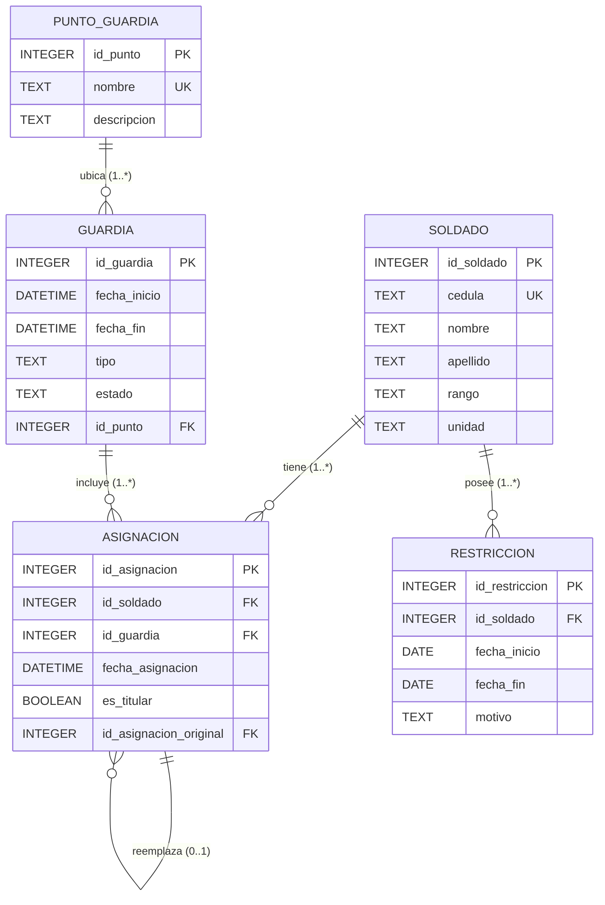
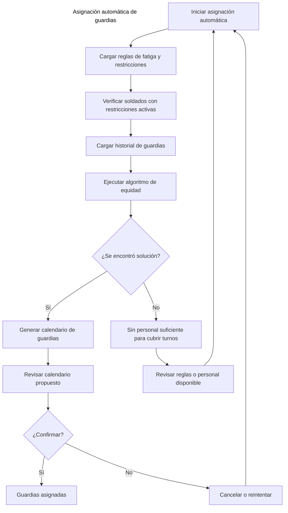
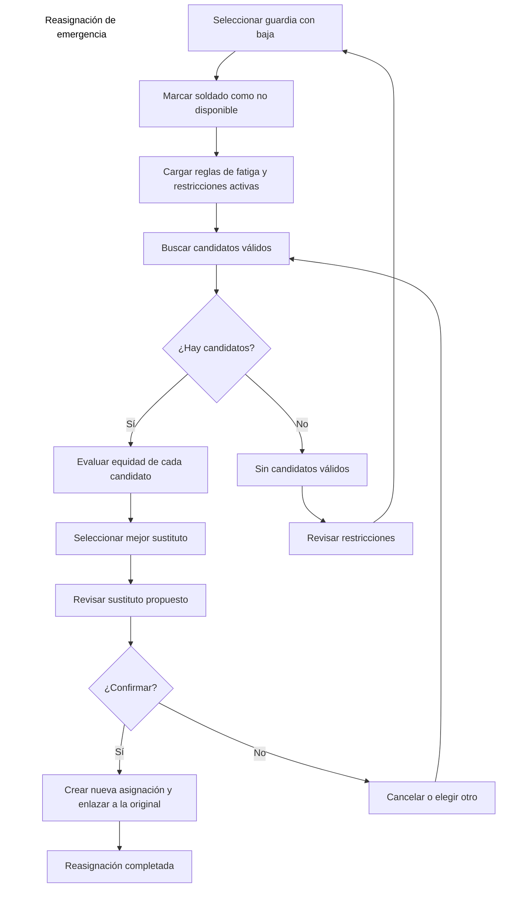
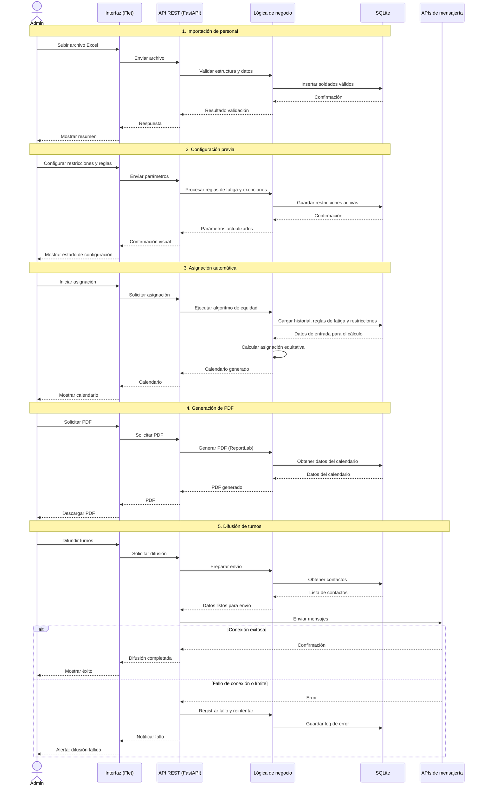

# 🪖 Sistema de Gestión de Guardias Militares

Automatiza la asignación de turnos de guardia con **equidad**, **control de fatiga** y **trazabilidad**, adaptable a cualquier unidad militar.

---

## 📊 1. Diagrama de Casos de Uso


---

## 🧱 2. Diagrama de Arquitectura


---

## 🗃️ 3. Diagrama Entidad-Relación (ER)


---

## 🔁 4. Diagrama de Flujo – Asignación Automática


---

## 🔁 5. Diagrama de Flujo – Reasignación de Emergencia


---

## 🔄 6. Diagrama de Secuencia – Flujo Completo del Sistema


---

## 🛠️ Stack Tecnológico

| Herramienta | Rol |
|-------------|-----|
| Python | Lenguaje principal |
| Flet | Interfaz de escritorio (Material Design 3) |
| FastAPI | API REST |
| SQLModel | ORM para la base de datos |
| SQLite | Base de datos local |
| Pandas | Lectura y validación de Excel |
| ReportLab | Generación de PDF |
| PyInstaller | Empaquetado en .exe |

---

## ⚡ Instalación

```bash
git clone https://github.com/Jaren2402/sistema-de-gestion-de-guardias.git
cd sistema-de-gestion-de-guardias
python -m venv venv
source venv/bin/activate  # En Windows: venv\Scripts\activate
pip install -r requirements.txt
cp .env.example .env  # Configurar variables de entorno
cd backend && uvicorn main:app --reload
```
---

## 🚀 Estado del Proyecto

- [x] Importación de soldados desde Excel
- [x] Asignación automática equitativa con ponderación de turnos
- [x] Gestión de restricciones (permisos, cursos)
- [x] Visualización de calendario por áreas
- [ ] Sustitución de emergencia
- [ ] Generación y envío de PDF
- [ ] Dashboard de estadísticas
- [x] Protección de rama y flujo de Pull Request

---

## 📄 Licencia

Este proyecto es de uso académico.

---

## 📄 Documentación

Para generar la documentación técnica del módulo de servicios, ejecute:

```bash
cd backend
python -m pydoc -w services
```